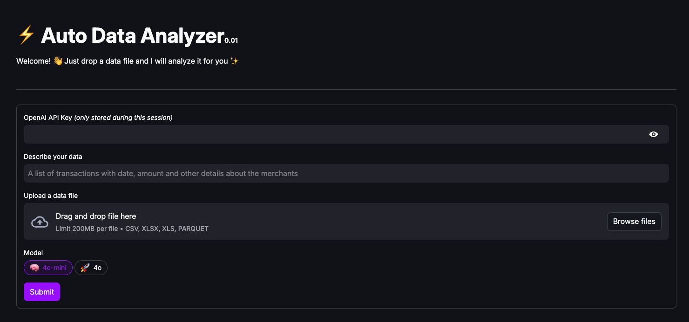

# ADA: the Auto-Data-Analyzer

## Overview

ADA's goal is to allow for easy and fast initial data exploration on a given dataset. As of now, it suggests and displays relevant plots for the dataset.

It uses the [CrewAI](https://crewai.com/) for LLM management and [Streamlit](https://streamlit.io/) to create the web app.

You can access a live version of the app [here](https://the-auto-data-analyzer.streamlit.app/).



## Installation

### Clone the repository and create a virtual environment

```bash
git clone https://github.com/ArthurVerrez/crewai-streamlit-hackernews-demo
cd crewai-streamlit-hackernews-demo
python -m venv env
```

### Activate the Environment

**Mac/Linux:**

```bash
source env/bin/activate
```

**Windows:**

```bash
env\Scripts\activate
```

### Install dependencies:

```bash
pip install -r requirements_loc.txt
```

> Note: `requirements.txt` is actually reserved for Streamlit Community Cloud, due to some incompatibilities of the `crewai` library.

## Usage

(Optional) Set `LLM_API_KEY` in the `.env` file, then run the app:

```bash
streamlit run app.py
```

## Links

- [CrewAI](https://crewai.com/)
- [Streamlit](https://streamlit.io/)
